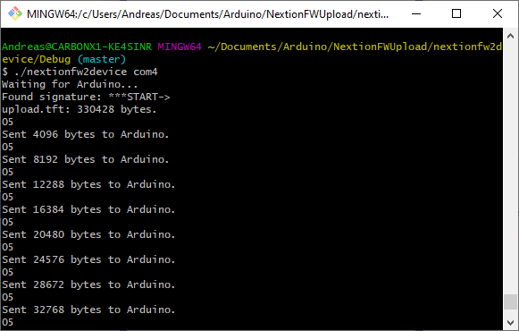

Nextion HMI display connected to Arduino Uno:
Usually the display is connected to pins 8,9 via softwareserial / NeoICSerial
so to keep the USB serial free for debugging and firmware updates.

How to upload new firmware to the Nextion HMI display?

Use this code and download it to the Arduino Uno.
Tested on nextion display with firmware S171.

The Nextion display must be connected to pins 8 , 9 on the Uno.

1. Load this sketch to the arduino UNO.
2. Connect the Arduino UNO via USB to the PC. This risults in a COMX port.
3. Use the win32 program nextionfw2device.exe COMX  to upload the file upload.tft
    to the nextion display.

Then use/compile the PC software in directory nextionfw2device .

This software tries to upload a file upload.tft 
to the com port specified in the command line.

Tricks:

Arduino Serial port buffer is only 64 bytes. The arduino fw/ pc software 
contain a simple acknowledge mechanism after each 48 bytes transferred over serial .

See also project nextionEmulate. This is an Arduino project that emulates the
firmware reading of a nextion HMI device and was used for debugging above code.

A standalone win32FWUpload.exe is also supplied. Connect the Nextion directly to the PC via an USB to serial 
converter.

